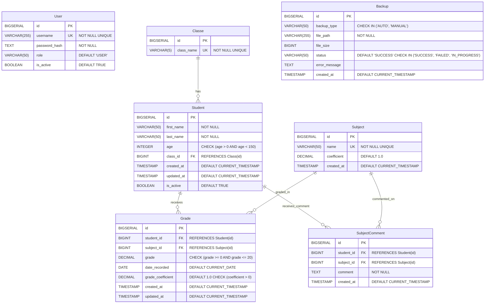

# Database 

## Diagram tables
* * *
### User Table
The `User` table is designed to manage user accounts within the system.
It contains essential information about each user, including their credentials, role, and account status.

```
+--------------------------------------------------+
|                      User                        |
+--------------------------------------------------+
| - id: BIGSERIAL PRIMARY KEY                      |
| - username: VARCHAR(255) NOT NULL UNIQUE         |
| - password_hash: TEXT NOT NULL                   |
| - role: VARCHAR(50) DEFAULT 'USER'               |  -- Default role value
| - is_active: BOOLEAN DEFAULT TRUE                |
+--------------------------------------------------+
```

### Class Table
The `Class` table stores information about academic classes.
Each class has a unique identifier, a name.
```
+---------------------------------------------------+
|                      Class                        |
+---------------------------------------------------+
| - id: BIGSERIAL PRIMARY KEY                       |
| - class_name: VARCHAR(5) NOT NULL UNIQUE          | -- example : T1, 5B, 3A ..
+---------------------------------------------------+
```

### Student Table
The `Student` table contains information about individual students. Each student has a unique identifier and various personnal details,
including their name, age... The table also tracks student's active status and timestamps for creation and updates.

```
+----------------------------------------------------------------------------------+
|                     Student                                                      |
+----------------------------------------------------------------------------------+
| - id: BIGSERIAL PRIMARY KEY                                                      |
| - first_name: VARCHAR(50) NOT NULL                                               |
| - last_name: VARCHAR(50) NOT NULL                                                |
| - age: INTEGER CHECK (age > 0 AND age < 150)                                     |  -- Constraint on age
| - class_id: BIGINT REFERENCES Class(id) ON DELETE SET NULL                       |  -- Foreign key with action
| - created_at: TIMESTAMP DEFAULT CURRENT_TIMESTAMP                                |
| - updated_at: TIMESTAMP DEFAULT CURRENT_TIMESTAMP                                |
| - is_active: BOOLEAN DEFAULT TRUE                                                |
+----------------------------------------------------------------------------------+
```

### Subject Table
The `Subject` table holds data about various subjects offered in the school. Each subject has a unique identifier, a name and a coefficient value indicating its weight in grading.

```
+---------------------------------------------------+
|                     Subject                       |
+---------------------------------------------------+
| - id: BIGSERIAL PRIMARY KEY                       |
| - name: VARCHAR(50) NOT NULL UNIQUE               |
| - coefficient: DECIMAL(3,2) DEFAULT 1.0           |  -- Default coefficient value 1
| - created_at: TIMESTAMP DEFAULT CURRENT_TIMESTAMP |
+---------------------------------------------------+
```
### Grade Table
The `Grade` table records the grades received by students for specific subjects.
Each record is linked to a student and a subject, includes the grade value, the recording date. Timestamps for creation and updates are also included.

```
+-----------------------------------------------------------------------+
|                              Grade                                    |
+-----------------------------------------------------------------------+
| - id: BIGSERIAL PRIMARY KEY                                           |
| - student_id: BIGINT REFERENCES Student(id) ON DELETE CASCADE         |  -- Foreign key with action
| - subject_id: BIGINT REFERENCES Subject(id) ON DELETE CASCADE         |  -- Foreign key with action
| - grade: DECIMAL(4,2) CHECK (grade >= 0 AND grade <= 20)              |  -- Constraint on grade
| - date_recorded: DATE DEFAULT CURRENT_DATE                            |  -- Default date recorded
| - coefficient: DECIMAL(3,2) DEFAULT 1.0 CHECK (coefficient > 0)       |  -- Coefficient for the specific grade
| - created_at: TIMESTAMP DEFAULT CURRENT_TIMESTAMP                     |
| - updated_at: TIMESTAMP DEFAULT CURRENT_TIMESTAMP                     |
+-----------------------------------------------------------------------+
```

### SubjectComment Table
The `SubjectComment' table is designed to store comments made by teachers for specific students in their respective subjects. Each comment is linked to a student and as subject, allowing for personnalised feedback.

```
+---------------------------------------------------------------+
|                    SubjectComment                             |
+---------------------------------------------------------------+
| - id: BIGSERIAL PRIMARY KEY                                   |
| - student_id: BIGINT REFERENCES Student(id) ON DELETE CASCADE |  -- Foreign key with action
| - subject_id: BIGINT REFERENCES Subject(id) ON DELETE CASCADE |  -- Foreign key with action
| - comment: TEXT NOT NULL                                      |  -- Comment from the teacher
| - created_at: TIMESTAMP DEFAULT CURRENT_TIMESTAMP             |  -- Timestamp for record keeping
+---------------------------------------------------------------+
```

### BackUp Table
The `Backup` table maintains a record of backup operations, including the type of backup , file path, size, status, and any error messages encountered during backup process. A timestamp for the creation of each log entry is also included

```
+----------------------------------------------------------------------+
|                  Backup                                              |
+----------------------------------------------------------------------+
| - id: BIGSERIAL PRIMARY KEY                                          |
| - backup_type: VARCHAR(50) CHECK (backup_type IN ('AUTO', 'MANUAL')) |  -- Backup type constraint
| - file_path: VARCHAR(255) NOT NULL                                   |
| - file_size: BIGINT                                                  |
| - status: VARCHAR(50) DEFAULT 'SUCCESS' CHECK                        |
|                     (status IN ('SUCCESS', 'FAILED', 'IN_PROGRESS')) |  -- Status constraint
| - error_message: TEXT                                                |
| - created_at: TIMESTAMP DEFAULT CURRENT_TIMESTAMP                    |
+----------------------------------------------------------------------+
```

## ER Diagram 

